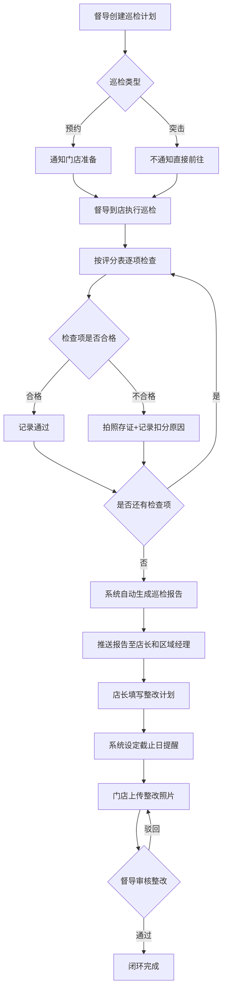

## 1. 产品概述

餐饮连锁门店品控巡检系统，专注于已开业门店的日常质量稽查管理。品控督导按计划对门店进行突击或预约巡检，按标准化评分表逐项检查，不合格项拍照存证并记录扣分原因，系统自动生成巡检报告推送至店长和区域经理，店长填写整改计划并上传整改照片，督导确认闭环。总部汇总各门店历次得分趋势，识别长期低分门店重点跟进，按区域排名督促竞争改进，统计不同品类问题频率帮助总部优化培训内容。

- 目标用户：品控督导、门店店长、区域经理、总部管理层
- 核心价值：标准化巡检流程、自动报告生成、整改闭环跟踪、数据驱动决策

## 2. 核心功能

### 2.1 用户角色

| 角色 | 录入方式 | 核心权限 |
|------|----------|----------|
| 品控督导 | 后台分配 | 创建巡检计划、执行巡检、拍照存证、确认整改闭环 |
| 门店店长 | 后台分配 | 查看巡检报告、填写整改计划、上传整改照片 |
| 区域经理 | 后台分配 | 查看辖区门店报告、区域排名、督促整改 |
| 总部管理层 | 后台分配 | 全局数据看板、门店得分趋势、问题频率统计、培训优化建议 |

### 2.2 功能模块

1. **总部看板**：全局得分概览、区域排名、门店得分趋势图、问题品类频率统计、长期低分门店预警
2. **巡检计划**：创建/编辑巡检计划、选择门店与督导、设定突击/预约类型、日历视图排期
3. **巡检执行**：按评分表逐项检查、不合格项拍照上传、记录扣分原因、实时计分
4. **巡检报告**：自动生成报告、推送通知、历史报告查询、报告详情查看
5. **整改管理**：店长填写整改计划、整改截止日提醒、上传整改照片、督导确认闭环
6. **门店管理**：门店信息维护、历史巡检记录、得分趋势曲线、区域归属
7. **评分模板**：创建/编辑评分表模板、分类管理（食材存储/卫生状况/出餐速度/员工仪容等）、权重设置

### 2.3 页面详情

| 页面名称 | 模块名称 | 功能描述 |
|----------|----------|----------|
| 总部看板 | 得分概览卡片 | 显示全部门店平均分、本月巡检次数、待整改项数、闭环率 |
| 总部看板 | 区域排名 | 按区域汇总平均分排名，支持升序/降序，点击查看区域详情 |
| 总部看板 | 门店得分趋势 | 折线图展示选定门店历次巡检得分变化，支持多店对比 |
| 总部看板 | 问题品类频率 | 柱状图展示各品类问题出现频次，辅助培训优化 |
| 总部看板 | 低分门店预警 | 列表展示连续3次低于合格线的门店，标注预警等级 |
| 巡检计划 | 计划列表 | 展示所有巡检计划，支持按状态/督导/门店筛选 |
| 巡检计划 | 创建计划 | 选择门店、督导、巡检类型（突击/预约）、日期时间 |
| 巡检计划 | 日历视图 | 月历展示巡检排期，颜色区分突击/预约/已完成 |
| 巡检执行 | 评分表检查 | 逐项打分，合格/不合格标记，滑动手势快速切换 |
| 巡检执行 | 拍照存证 | 不合格项点击拍照按钮，调用摄像头拍照并关联检查项 |
| 巡检执行 | 扣分原因 | 不合格项填写扣分原因，支持预设原因快速选择 |
| 巡检执行 | 实时计分 | 底部悬浮显示当前得分，动态更新 |
| 巡检报告 | 报告列表 | 按时间/门店/督导筛选历史报告 |
| 巡检报告 | 报告详情 | 展示各项得分、不合格项照片、扣分原因、总分与等级 |
| 巡检报告 | 推送通知 | 报告生成后自动推送至店长和区域经理 |
| 整改管理 | 待整改列表 | 按门店/紧急度筛选，显示整改截止日倒计时 |
| 整改管理 | 填写整改计划 | 店长对不合格项填写整改措施和预计完成日期 |
| 整改管理 | 上传整改照片 | 门店上传整改完成后的现场照片 |
| 整改管理 | 督导确认闭环 | 督导查看整改照片后确认通过或驳回 |
| 整改管理 | 截止日提醒 | 整改截止日前1天/当天自动提醒店长和区域经理 |
| 门店管理 | 门店列表 | 按区域/状态筛选，显示最近得分和预警状态 |
| 门店管理 | 门店详情 | 基本信息、历次巡检记录、得分趋势曲线 |
| 评分模板 | 模板列表 | 展示所有评分模板，支持启用/停用 |
| 评分模板 | 模板编辑 | 添加检查分类和检查项，设置分值与权重 |

## 3. 核心流程

督导在系统中创建巡检计划，选择目标门店和巡检类型（突击或预约），设定日期时间。到达门店后，督导按标准化评分表逐项检查，合格的直接通过，不合格的拍照存证并填写扣分原因。全部检查完成后系统自动计算总分并生成巡检报告，推送至店长和区域经理。店长收到报告后对每个不合格项填写整改计划并设定截止日期，系统在截止日前自动提醒。门店完成整改后上传现场照片，督导审核确认后闭环。总部看板汇总各门店历次得分，识别低分门店和问题品类。

## 4. 用户界面设计

### 4.1 设计风格

- 主色调：深蓝 #1B2A4A（专业严谨），辅色：琥珀橙 #E8913A（警示强调）
- 按钮：圆角8px，主按钮深蓝实底，次按钮浅蓝描边，危险操作橙红实底
- 字体：标题使用 Noto Serif SC（衬线中文字体，体现严谨），正文使用 Noto Sans SC
- 布局：左侧固定导航栏 + 右侧内容区，卡片式布局，信息密度适中
- 图标：线性图标风格，统一2px描边宽度
- 数据可视化：ECharts风格，图表配色与主题一致

### 4.2 页面设计概览

| 页面名称 | 模块名称 | UI元素 |
|----------|----------|--------|
| 总部看板 | 得分概览卡片 | 4列卡片布局，每张卡片含图标+数字+趋势箭头，深蓝底白字 |
| 总部看板 | 区域排名 | 水平条形图，渐变填充，前三名高亮金色边框 |
| 总部看板 | 门店得分趋势 | 多折线图，鼠标悬浮显示详细数据，支持图例筛选 |
| 总部看板 | 问题品类频率 | 纵向柱状图，琥珀橙渐变色，悬停显示占比 |
| 总部看板 | 低分门店预警 | 表格+预警标签，红色脉冲动画标注紧急度 |
| 巡检计划 | 计划列表 | 表格布局，状态标签彩色徽章，支持行内快捷操作 |
| 巡检计划 | 创建计划 | 右侧抽屉式表单，门店选择器下拉+搜索，日期时间选择器 |
| 巡检计划 | 日历视图 | 月历网格，日期单元格内显示巡检标签，颜色区分状态 |
| 巡检执行 | 评分表检查 | 手风琴式分类展开，每项右侧通过/不通过切换按钮 |
| 巡检执行 | 拍照存证 | 底部弹出拍照面板，照片缩略图列表，支持重拍 |
| 巡检执行 | 实时计分 | 底部固定悬浮条，圆形进度环+当前分数 |
| 巡检报告 | 报告列表 | 卡片列表，缩略图+摘要+分数徽章 |
| 巡检报告 | 报告详情 | 纵向时间线布局，不合格项展示照片+原因 |
| 整改管理 | 待整改列表 | 看板式布局（待整改/整改中/已完成三列），卡片拖拽 |
| 整改管理 | 填写整改计划 | 模态框表单，日期选择器+文本域 |
| 整改管理 | 上传整改照片 | 拖拽上传区+照片预览网格 |
| 整改管理 | 督导确认闭环 | 对比视图：问题照片 vs 整改照片，通过/驳回按钮 |
| 门店管理 | 门店列表 | 表格+搜索栏，得分色阶标签（绿/黄/红） |
| 门店管理 | 门店详情 | 顶部信息卡+中部趋势图+底部巡检记录时间线 |
| 评分模板 | 模板列表 | 卡片网格，每张卡片展示模板名称+检查项数+使用次数 |
| 评分模板 | 模板编辑 | 左侧分类树+右侧检查项列表，拖拽排序 |

### 4.3 响应式设计

- 桌面优先设计，最小宽度1280px
- 中等屏幕（1024-1279px）：侧边栏折叠为图标模式
- 平板适配：巡检执行页面优化触控操作，拍照按钮加大点击区域
- 移动端：巡检执行和整改拍照支持移动端操作，简化表格为卡片列表

### 4.4 3D场景指引

不适用
