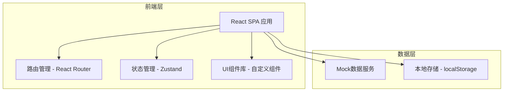
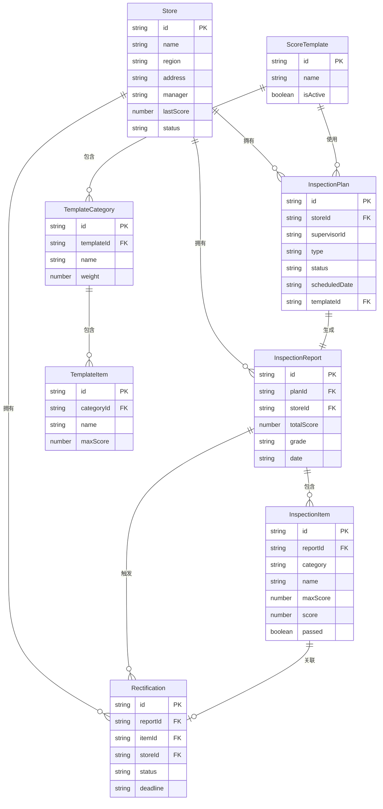

## 1. 架构设计



## 2. 技术说明

- 前端：React@18 + TypeScript + TailwindCSS@3 + Vite
- 初始化工具：Vite
- 状态管理：Zustand
- 路由：React Router v6
- 图表：Recharts
- 日期处理：date-fns
- 后端：无（纯前端Mock数据）
- 数据库：无（localStorage + 内存Mock数据）

## 3. 路由定义

| 路由 | 用途 |
|------|------|
| / | 重定向至 /dashboard |
| /dashboard | 总部看板 - 全局数据概览 |
| /inspections | 巡检计划 - 计划列表与创建 |
| /inspections/calendar | 巡检日历视图 |
| /inspections/:id/execute | 巡检执行 - 评分表检查 |
| /reports | 巡检报告 - 报告列表 |
| /reports/:id | 巡检报告详情 |
| /rectifications | 整改管理 - 看板视图 |
| /stores | 门店管理 - 门店列表 |
| /stores/:id | 门店详情 |
| /templates | 评分模板 - 模板列表与编辑 |

## 4. API定义（Mock数据接口）

```typescript
interface Store {
  id: string
  name: string
  region: string
  address: string
  manager: string
  phone: string
  lastScore: number
  avgScore: number
  status: 'normal' | 'warning' | 'danger'
  scoreHistory: { date: string; score: number }[]
}

interface InspectionPlan {
  id: string
  storeId: string
  storeName: string
  supervisorId: string
  supervisorName: string
  type: 'surprise' | 'scheduled'
  status: 'planned' | 'in_progress' | 'completed' | 'cancelled'
  scheduledDate: string
  completedDate?: string
  templateId: string
  templateName: string
}

interface InspectionReport {
  id: string
  planId: string
  storeId: string
  storeName: string
  supervisorName: string
  date: string
  totalScore: number
  maxScore: number
  grade: 'A' | 'B' | 'C' | 'D'
  items: InspectionItem[]
}

interface InspectionItem {
  id: string
  category: string
  name: string
  maxScore: number
  score: number
  passed: boolean
  photos?: string[]
  deductionReason?: string
}

interface Rectification {
  id: string
  reportId: string
  itemId: string
  storeId: string
  storeName: string
  itemName: string
  deductionReason: string
  status: 'pending' | 'planned' | 'rectifying' | 'completed'
  plan?: string
  deadline?: string
  rectificationPhotos?: string[]
  submittedAt?: string
  confirmedAt?: string
  confirmedBy?: string
}

interface ScoreTemplate {
  id: string
  name: string
  description: string
  isActive: boolean
  usageCount: number
  categories: TemplateCategory[]
}

interface TemplateCategory {
  id: string
  name: string
  weight: number
  items: TemplateItem[]
}

interface TemplateItem {
  id: string
  name: string
  maxScore: number
  description: string
}
```

## 5. 服务端架构图

不适用（纯前端项目，使用Mock数据）

## 6. 数据模型

### 6.1 数据模型定义



### 6.2 数据定义语言

本项目使用前端Mock数据，无需DDL。初始数据包含：
- 12家门店（分布于华东、华南、华北、西南4个区域）
- 6份评分模板（通用巡检、食品安全专项、卫生专项、服务专项、出餐速度专项、新店开业）
- 30+条巡检历史记录
- 20+条待整改/整改中/已完成记录
- 各门店3-6个月的得分趋势数据
